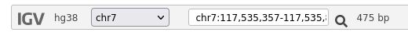
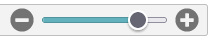
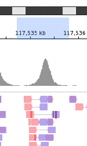
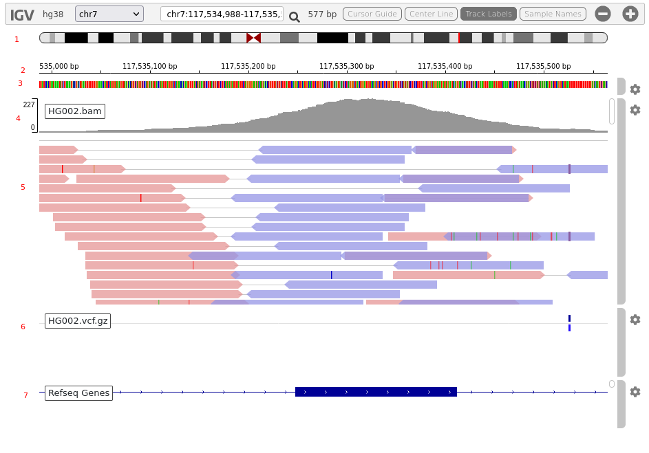
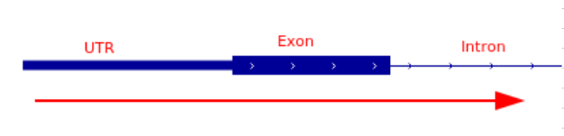

# IGV

## Context

In this session we will be looking at how IGV can be used for visualizing mutations in NGS data. In this scenario exome sequencing has been performed on a DNA sample, sequence reads have been aligned to the reference genome (GRCh37) and a variant caller has been run.

Variant calling algorithms are not perfect at distinguishing real variants from artifacts in the data. When we process NGS data to generate variant calls this also generates various metrics for each of those calls which can be useful in determining wheter a variant call is real. However, it is often not possible to interpret these metrics with certainty, and in these cases visual inspection and interpretatin of the read data underlying the variant calls can be the most useful approach to adjust our confidence in the accuracy of the variant calls, and determine if a variant call is real or artifact. Furthermore, complex variation may not be accurately described by the variant caller (or may not be called at all), and visual inspection of the data can be useful to characterise these complex events.

Visual inspection of variant calls usually takes place during either:
 - interpretation of a specific variant in a specific case
 - investigation of non-concordant variant calls during testing/validation of an assay

In the former case, it's important to be able to determine if a called variant is real or not, as this will influence whether additional work is performed to confirm the presence of that variant, and/or whether the variant is reported within the patient result.

In the latter case, visual inspection can provide clues as to the reasons for non-concordance which can aid with troubleshooting and inform the development of improved processes.

In this session we will inspect some regions of the genome where there are possible variants to determine whether these are real events or artifacts. These will include single nucleotide variants (SNVs), small insertions and deletions (indels) and larger structural rearrangements.

Acknowledgement

The material presented here is adapted from https://bioinformatics-core-shared-training.github.io/intro-to-IGV/InspectingVariantsInIGV.html, which was itself adapted from https://github.com/griffithlab/rnaseq_tutorial/wiki

## What is IGV

The Integrative Genomics Viewer (IGV) is a high-performance, easy-to-use, interactive tool for the visual exploration of genomic data. It supports flexible integration of all the common types of genomic data and metadata, investigator-generated or publicly available, loaded from local or cloud sources.

https://software.broadinstitute.org/software/igv/

In clinical genomics IGV most commonly used to visualise NGS reads, often in the context of other information (e.g. genome sequence, genes, transcripts)

## How to access IGV

IGV is available in multiple forms, including:

 - the original IGV - a Java desktop application
 - [IGV-Web](https://igv.org/app/) - a web application 
 - igv.js - a JavaScript component that can be embedded in web pages (for developers)

For this session we will be using IGV-Web. This runs in a browser, but does not send any data to the host site, so can also be used to view patient data without breaching IG requirements.

# Data
We will be using data generated by sequencing HG002 using an exome sequencing assay. 
HG002 is a sample which as been sequenced by multiple technologies to generate a high confidence variant call truth set. This means that for many regions of the genome we know which variant calls should be present within this sample with a high degree of certainty. By comparing the variant calls in the truth set to the variant calls we have generated for this sample, we can more easily determine which calls are real, and which are artifact.

The data we will be viewing is stored in DNAnexus at https://platform.dnanexus.com/panx/projects/GBVYpp04KXQXgJXK9YFJVXq3/data/

You will also be able to load other data from patient samples and inspect putative variants calls within these, but for these you will not have the benefit of a truth set, so will need to interpret the validity of the variant call using only visual inspection.

## How to use IGV

IGV can visualise many different types of genomic data. We will be using it to display variant calls and the sequencing data which was used to generate those variant calls.

**VCF** Variant calls are stored in VCF files. VCF is the standard file format for describing variant calls\
**BAM** The aligned sequencing reads are stored in BAM files. A sequencing run will generate sequencing reads which each contain a fragment of the target genome, however at this stage we don't know where that fragment belongs in the genome. The reads are aligned to a reference genome to determine their original position in the genome. A bam file contains a description of each sequencing read (the bases and their quality scores) and the location to which that read was aligned to in the genome\
**BAI** These are index files which contain metadata for the bam files. These are needed to enable IGV to quickly search the bam file for the reads which need to be displayed

The data we are using is stored in the cloud. Rather than download the data, we will load it into IGV using a URL, which will stream the necessary data to IGV as you view it. 

First we will prepare IGV

 1. Open https://igv.org/app/
 2. Select Genome > GRCh38
 3. Keep this tab open - we will come back to it in a moment

Next we will prepare links to the data we wish to view

 1. In another tab, log in to [DNAnexus](https://platform.dnanexus.com/login)
 2. Navigate to https://platform.dnanexus.com/panx/projects/GBVYpp04KXQXgJXK9YFJVXq3/data/
 3. Navigate to `/data/HG002`
 4. Select the files you wish to view by ticking the checkbox
    4a. If viewing a vcf or bam file, you will also need to select the associated index file at the same time
        i.e.`bam + bai`
            `vcf.gz + vcf.gz.tbi`
 5. Click `Download` in the top right corner
 6. Get the URL from the popup window, by either
   6a. Clicking the `Get URL` button against each file
   6b. Clicking the `Bulk URLs` tab at the top
 
 Now we have both IGV and data URLs prepared, we can load the data into IGV:
 
  1. In your IGV browser tab, click `Tracks > URL`
  2. Paste the URL for a bam, vcf, or bed file into `Track URL`
  3. If loading a bam or vcf file, then also paste the associated index file (.bai or vcf.gz.tbi) URL into `Index URL`
  4. Click OK

Note: URLs for files in DNAnexus will only be valid for 24hours, so if you want to load the same files into IGV at a later date you'll need to create new URLs and load these into IGV.

At this stage you have loaded data into IGV and should be able to begin exploring the data. For this session we will want to load the bam + bai, and the vcf.gz + vcf.gz.tbi before continuing. This will allow us to view the sequencing data (from the bam file) and the variant calls (from the vcf file) together.

## IGV Navigation Basics

### Moving around

There are many ways to navigate to a region you wish to visualise. You will usually want to search for the region you wish to view using the search box:  
   
 
 This will accept any of the following:
 - genomic coordinates range
   - `chr7:117,559,332-117,559,529`
   - `7:117,559,332-117,559,529` 
   - `7:117559332-117559529`
 - genomic coordinates single position
   - `chr7:117,559,479`
 - gene symbol
   - `CFTR`
 
 (Note that if the region selected contains too much data then you will need to zoom in before the reads are displayed - see below)
 
 You can also adjust the region being displayed in various ways
 - Zoom in/out  
 Zoom using `+` and `-` and the slider in the top right  
   
 - click and drag left or right within the data (bam or vcf) tracks to scroll
 - click and drag to draw a box in the genome ruler track to select a region to view  
    
 
 
 ### Tracks
IGV displays data in tracks  
  

The tracks we have loaded for this session are (from top to bottom)
  1. Ideogram  
  A map of the currently viewed chromosome
  2. Genome ruler  
  Coordinates in the currently viewed chromosome
  3. Genome sequence  
  Contains the individual bases in the reference genome. Only displayed when zoomed in
  4. Depth of coverage  
  Shows the depth of reads mapped to each position.
  Colours indicate the presence and distribution of variation in the reads at this position
  5. Reads  
  The individual sequencing reads are displayed at the position they are aligned to within the reference genome
  6. Variant calls  
  Putative variant calls extracted from the reads data
  7. Refseq genes  
  Shows features (exon/intron/UTR) of the genes within the genome
    

#### Reads track description needed?

## Useful options
IGV has many many options which are useful for specific purposes, but a few of the most useful for this session are described below:

#### Soft clipping
When reads only partialy align to the reference genome the unaligned sections of the reads are hidden from view by default. These hidden parts sometimes contain very useful information, so it's useful to display them

Access via the bam track cog menu. Select `Show soft clips`

chr7:117,479,629-117,480,441

#### Colour by read strand
Colours reads according to which strand of the DNA was sequenced, and the direction of sequencing
pink = sequenced from left to right on the forward strand
blue = sequenced from right to left on the reverse strand
This can be useful for discriminating between artifacts and real variant calls.

Access via the bam track cog menu. Select `Color by:` > `Read strand`

#### View as pairs
Display read pairs linked together with a line joining the inner ends
Presentation of the data is less compact, but extra information can be obtained from a linked pair of reads

Access via the bam track cog menu. Select `View as pairs`

## Variant inspection
In this section, we will become familiar with the appearance of the different types of variation within IGV, then learn to distinguish true positive from false positive variant calls.
 
 ### Single nucleotide variants (SNVs)
  - Hom
    - `13:32337751` (TP)
    - `13:32340869` (TP)
    - `X:41134685` (TP)
    - `Y:7064065` (TP)
    - `7:143720229` (FP)
    - `19:35372239` (FP, wrong GT)

  - Het
    - `13:32340099`  (TP)
    - `17:43099914`  (TP)
    - `1:6545786` (TP, 1/2)
    - `19:54633116` (FP)
    - `22:15820262` (FP)
    - `Y:56878338` (?)

  - Indel
    -  Deletion  
      -  `9:130265925` (TP)
      -  `7:150474511` (TP)
      -  `16:5239850` (FP)
      -   `241317535` (FP)
    -  Insertion  
      -  `2:85754659` (TP)
      -  `2:119437075` (TP)
      -  `3:141971552` (FP)
      
    -  Repeats

 - CNVs
   - breakpoints

## Important considerations
Allele depth
Strand bias
Position bias
Multimapped reads
Lots of variation

## Variant  interpretation
Good and bad examples for each

# Indels
In
del
Indel

Good and bad examples for each

# CNV
Breakpoints

Soft clipping
